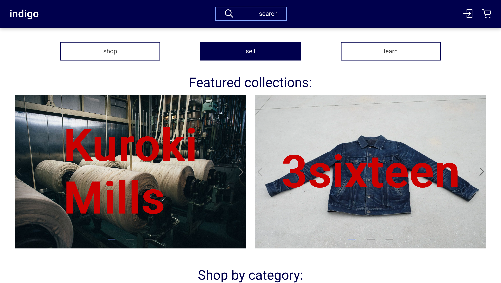
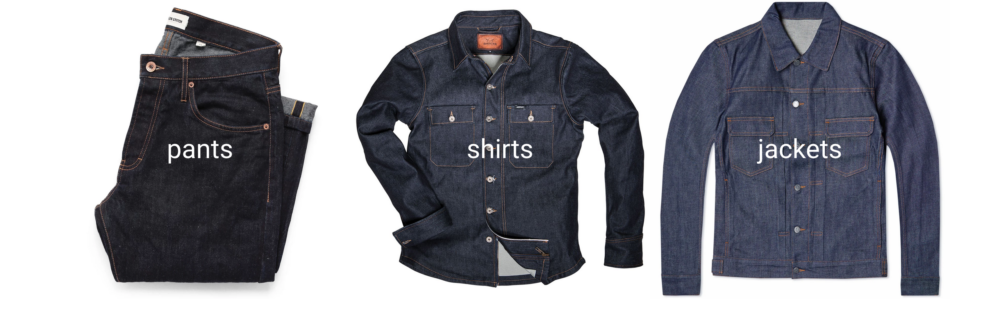
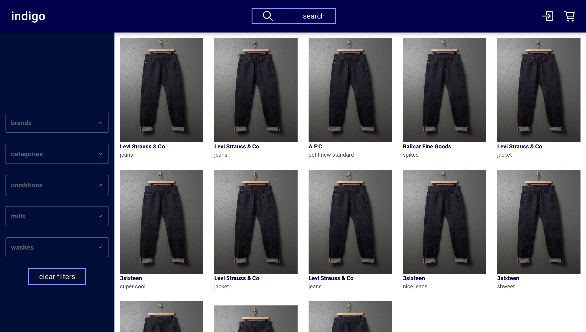
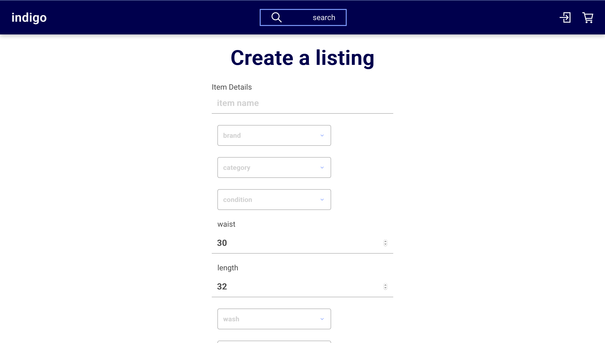
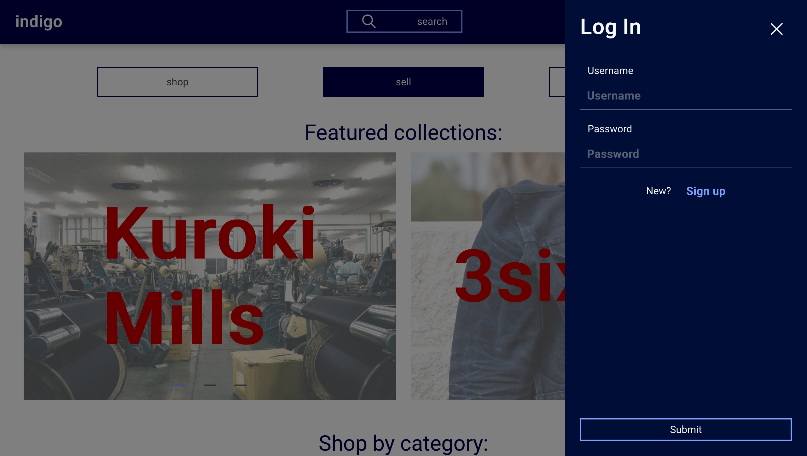
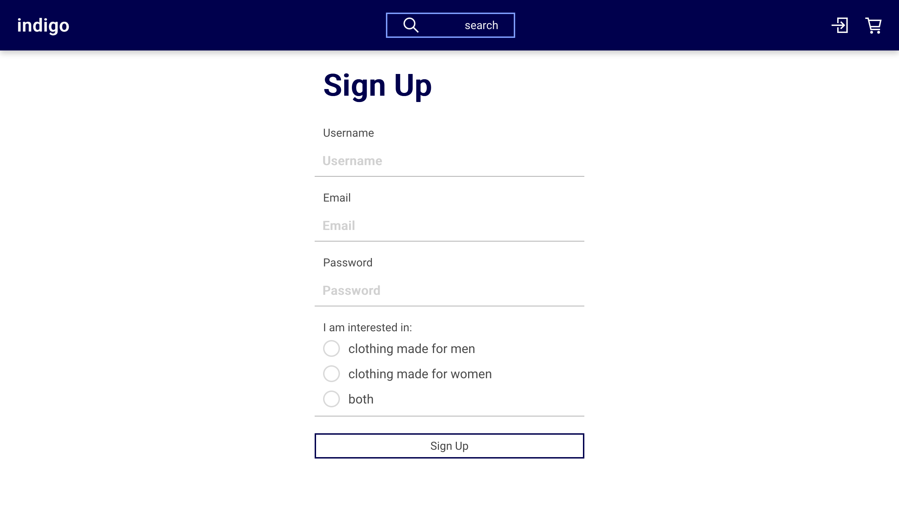

# Indigo

## Description

A clothing resale application created specifically for denim. It allows listing, sorting, and filtering based on denim specific attributes, creating a marketplace tailored to the needs of new and vintage high-quality denim garments.

## Technologies

### Front-End

Indigo is built using React as its front-end framework.

React hooks and Redux are utilized in order to manage stateful logic, while Grommet UI is utilized to create a cohesive user interface.

### Back-End

[Link to Back-End Repo](https://github.com/shanelonergan/indigo-api)

Indigo's API is built with Ruby on Rails, utilizing JWT and BCrypt for security, and PostgreSQL for its database. Active Model serializer is utilized to organize JSON responses.

## Installation

    Clone the repo and CD inside the directory
    npm install
    npm start

Make sure to visit the repo for the backend and follow those instructions as well.

## Screenshots

